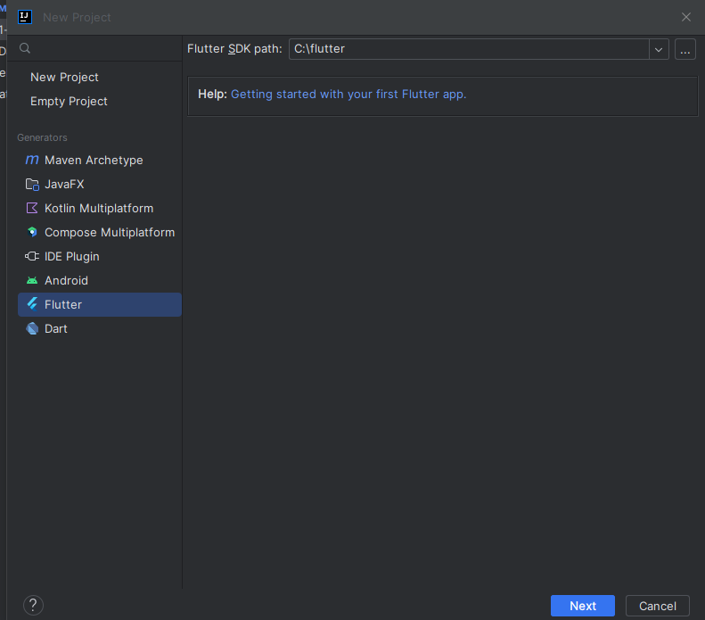

# Installation guide for Dart (Install this first for now)

`For flutter, check [2_Flutter_Installation] (ofc, after Dart)`

1. Watch this **[video](https://www.youtube.com/watch?v=ExDYQcswRCU)** till `10:30` and do what he's doing.
2. After that, to complete Dart installation, on Intellij, go to `File` -> `New`-> Click `Project..`
3. A new project window will appear, go to Flutter, then copy `C:\flutter` to Flutter SDK Path, then click `Next`,
   then `Cancel` Check the Image below:
4. Now repeat Step `2.`, then go to Dart and copy `C:\flutter\bin\cache\dart-sdk` to Dart SDK Path, click `Next`, name
   your project, and congrats, your 1st Dart project has been created.
   
